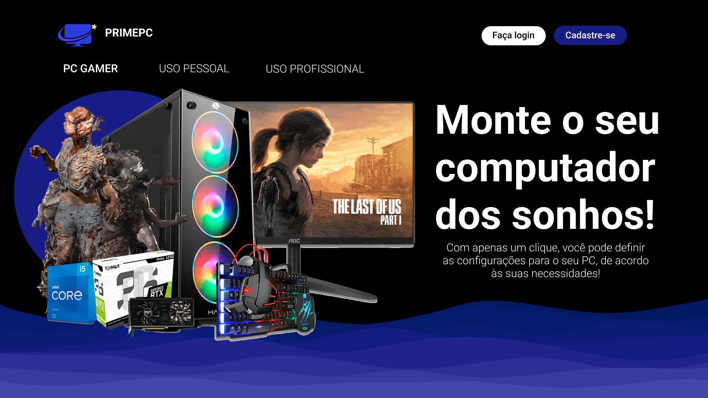
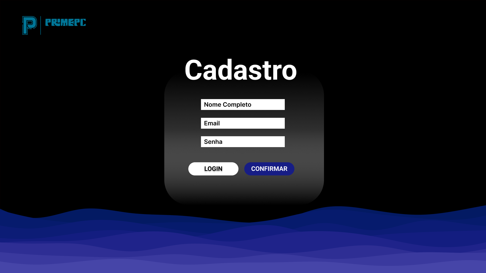
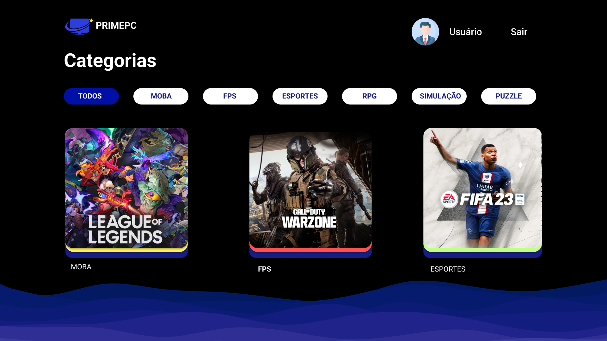
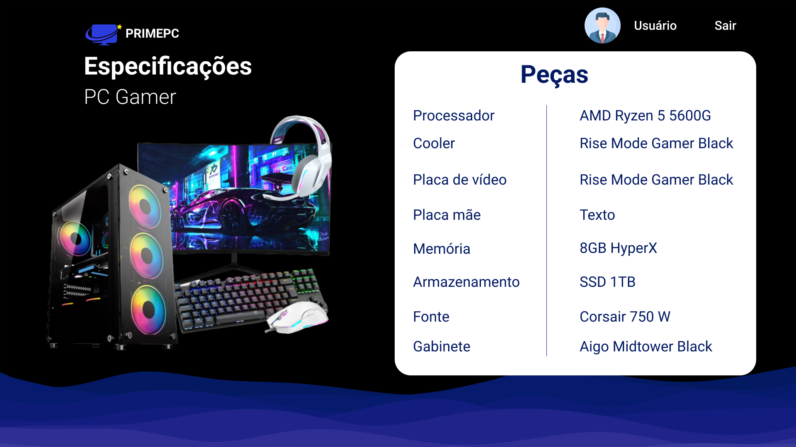
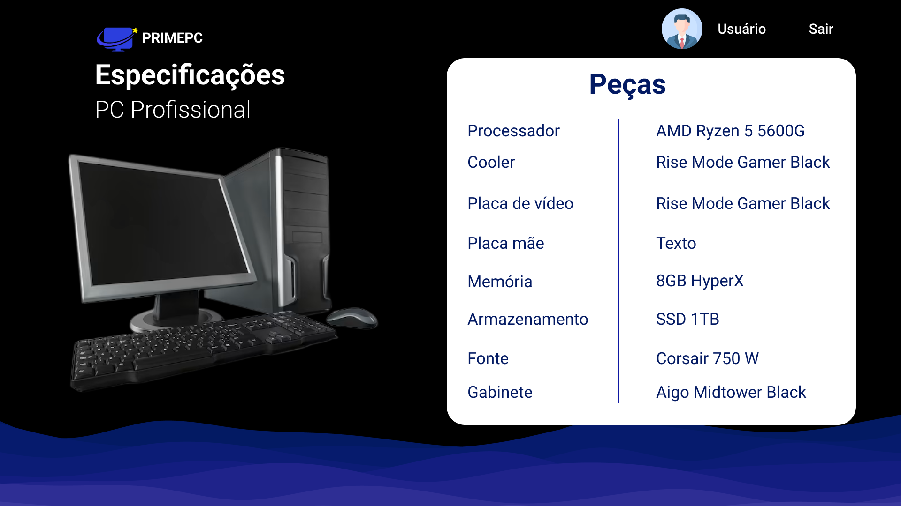
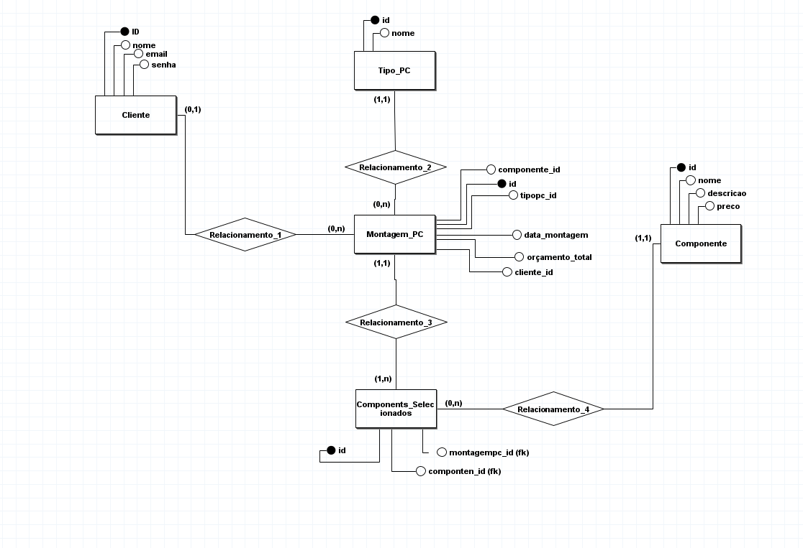
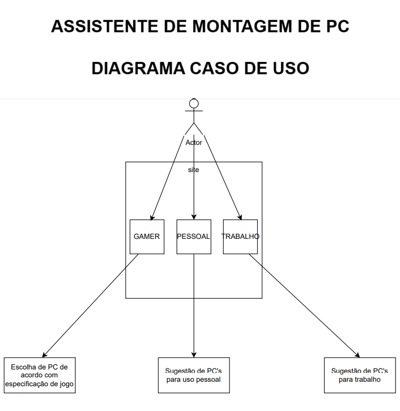

# 💻 Projeto Integrador III - Assistente de Montagem de PC

Bem-vindo ao **Assistente de Montagem de PC**, uma aplicação projetada para facilitar a montagem de computadores personalizados, atendendo às necessidades do usuário com base em orçamento, finalidade e nível de conhecimento técnico.

## 👥 Integrantes do Projeto
- **Arthur Silva**
- **Alexsandro Alves**
- **Eliseu Ferreira**
- **Kayke Ribeiro**
- **Samuel Levi**

### Professor Orientador
- **Enoque Leal**

---

## 🚀 Principais Funcionalidades
- **Montagem Personalizada**: Sugestão de componentes de hardware de acordo com o orçamento e a finalidade (jogos ou uso profissional).
- **Facilidade para Usuários Leigos**: Interface intuitiva que não exige conhecimento técnico prévio sobre hardware.
- **PC Pré-Montado**: Proposta de um PC já configurado para facilitar a aquisição das peças pelo usuário.

---

## 🛠️ Requisitos do Sistema
1. **Página Inicial**: Apresentação do sistema e funcionalidades.
2. **Página de Login**: Acesso restrito para usuários cadastrados.
3. **Página de Cadastro**: Registro de novos usuários.
4. **CRUD para Operadores**: Ferramentas administrativas para gerenciar o sistema.
5. **Tela do Usuário**: Interface para escolha de tipo de PC (gamer ou profissional).
6. **Tela de Categorias**: Escolha de configurações específicas, como jogos ou programas.
7. **Tela de Especificações**: Apresentação detalhada dos componentes sugeridos para o usuário.

---

## 🖼️ Capturas de Tela

### Página Inicial


### Login


### Cadastro


### Escolha do Tipo de PC


### Categorias


### Especificações Gamer


### Especificações Profissionais


---

## 📊 Estrutura do Sistema

### 🔹 Diagrama ERD Lógico


### 🔹 Diagrama ERD Conceitual


### 🔹 Diagrama UML


---

## 🛠️ Tecnologias Utilizadas
- **Front-end**: JSP, HTML, CSS e JavaScript.
- **Back-end**: Java com Jakarta Servlet.
- **Banco de Dados**: MySQL.
- **Metodologias**: DAO (Data Access Object).

---

## 📦 Como Executar o Projeto

### 1. Clone o Repositório
```bash
git clone https://github.com/seu-repositorio/assistente-montagem-pc.git
